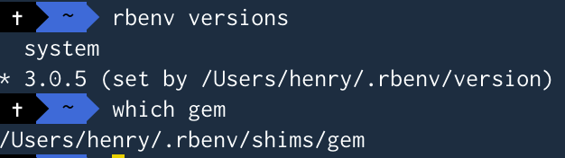

### Flutter Install＆Project作成
> FlutterのINSTALL＆PJ作成

1. Flutter 설치
    - [公式 - Flutter download](https://flutter.dev/docs/get-started/install)
      - [Android Studio INSTALL](https://developer.android.com/studio)
          - Android Virtual Device INSTALL(エミュレート)
          - brew install flutter
          - javaを探せない問題発生. 　
          - $SDKMAN_DIR/candidates/java/curent/bin　
          ~~~
          brew install flutter
          brew install android-studio
          cd /Applications/Android Studio.app/Contents
          ln -s ../jre jdk
          ln -s "/Library/Internet Plug-Ins/JavaAppletPlugin.plugin" jdk
          brew install ruby-build rbenv
          rbenv install -l
          rbenv install 3.0.5
          rbenv global 3.0.5
          rbenv init
         
         ~~~
        - additional check
        - 
        - 
        
        - ruby set
        - 
        - 
        
        - version　確認　gem 確認 
 
        - 
        - doctot check

        - 
        

  - 環境変数 
  - windowsの場合、
     ~~~
     {設置された場所}\flutter\bin
     ~~~
    
2. Flutter Project 作成
    - Android StudioはPluginを設定したら、Android開発時のProject生成と同じ。
    - VSCodeで開発時、
      - console上から
        ~~~
        1. flutter create my_app(PJ name) 
        2. cd my_app(PJ name)
        3. code .
        4. lib/main.dart　選択
        5. 右クリック -> Run without Debugging OR Start Debuggingを選択および、実行。
        ~~~

    - only console
      - flutter pub get 又は flutter packages getを実行すると、「pubspec.yml」に定義されたのを設定. vscodeでは最初実行時GUIで自動でINSTALLするかを確認してくれる。
      - flutter build [web, window, ...]を入力し、最終ファイルBUILDが可能。
      - flutter runを実行すると、CONSOLEにてTARGETの洗濯ができる。 洗濯したTARGETで実行される。

3. 重要なFOLDERおよびファイル
    - lib/main.dartはJAVAのMAINと同じファイル。
    - pubspec.ymlはdependancyとRESOURCE関連情報があるファイル(gradleと同じ)
        - yaml 形式でインデントで構造化されている
        - androidのAndroidManifest.xmlくらいの重要なファイル

    - iOSの場合、xcodeでコンパイルできるPJ
    - androidの場合は、Android StudioでコンパイルできるPJ

4. あらかじめチェックしておくべきこと(sdk 2.X 以前)
    - FRONTEND開発者の思考で開発を行う。
    - 구조상 들여쓰기와 괄호에 엄청난 스트레스를 받게된다. 다행히 개발툴들이 보조기능을 지원해준다.
    - 백그라운드 지원안한다(백그라운드 구현하려면 네이티브 코드와 채널로 연결해야 한다)
    - widgetで厚生された画面を作成することが作業のメインとなる。
    - iOS(Cupertino)とAndroid(Material) Widgetが別途存在する。
    - 結局 **iOSではUIを再構成**する必要性あり。
    - 宣言型の構造である。 F(state) = view. 이 말은 화면구현을 화면객체의 메소드로 구현하는 것이 아닌, 값이 바뀌면 화면이 바뀌는 구조로 되어 있다는 것이다.
    - 그러므로 선언된 객체의 메소드와 프로퍼티로 화면을 바꾸겠다는 생각을 접는 것이 좋다(바인딩된 변수값이 변하면 연결된 화면도 변함).
    - Native 기능의 많은 부분을 플러그인으로 해결해야햔다(플러터는 멀트플랫폼 UI 엔진임을 잊어서는 안된다).
    - 플러그인끼리 종종 충돌한다(SDK 버전호환성). 결국 Channel로 Native 코드(iOS, Android)를 만들어 통신하는 것이 속편할 때가 있다.
    - 플러터로 제약없는 앱을 만들고자 한다면 결국, Native Project(iOS, Android)를 개발할 수 밖에 없다
    - 플러그인 정보는 [pub.dev](https://pub.dev)이 답이다.
    - [widget SAMPLE](https://flutter-widget.live/basics/introduction)

5. 개발환경 참고사항(sdk 2.X 이전)
    - flutter run -d chrome --web-renderer html 를 해야 Web에서 외부네트워크를 이용한 이미지 로딩 시 에러가 발생하지 않는다.
    - flutter 2.X대부터 공식적으로 웹 퍼블리싱 가능하다(빌드시 웹으로 연결). 
