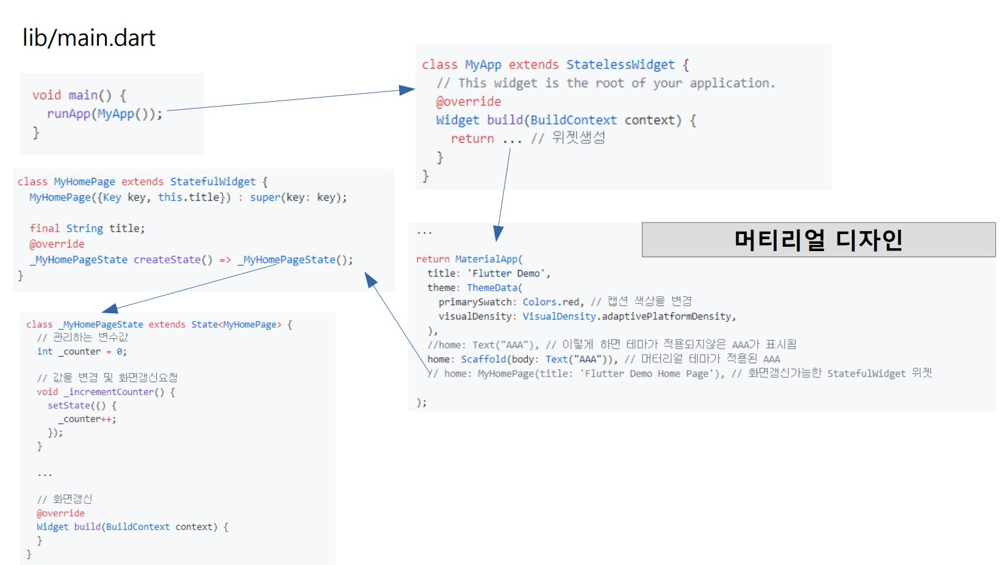

### Flutterの基本的なアプリ構造を概観しましょう。



1.プロジェクトを作成すると、lib/main.dartにmain関数が存在します。
   runApp() 関数を呼び出してアプリが開始されます。

    - runApp()関数は、引数としてWidgetを受け取ります。
    - WidgetはFlutterのUIを構成する基本単位です。
    - Widgetは他のWidgetを含んで階層構造（親子関係）を形成します。これは画面内に画面を構成する概念です。
    - Widgetは階層構造を持つため、右側のインデントが多くなる傾向があります。

~~~dart 
    void main() {
      runApp(MyApp()); 
    }
~~~


StatelessWidgetは状態を管理しないWidgetです。自身で状態（データの変更）を変更することはできません。
StatefulWidgetは状態が変更されると、Widgetの画面を更新するために使用されます。

2. 上記の例では、MyAppはStatelessWidgetを継承(Inheritance)したWidgetです。

    - StatelessWidgetのBuildMETHODでWidgetを生成＆RETURN.
    - 簡単な一つのWidgetから複雑なテーマを含めた 
       ContainerWidgetまで色々RETURNができる。
    - 

    ~~~ dart
    class MyApp extends StatelessWidget {
    //build method
      // This widget is the root of your application.
      @override
      Widget build(BuildContext context) {
        return ... //create widget 
      }
    }
    ~~~
   - 
   - **StatelessWidget**は状態を管理しないWidgetです。自身で状態（データの変更）を変更することはできません。
   -  逆に**StatefulWidgetd**は状態が変更されると、Widgetの画面を更新するために使用されます。


3. buildメソッドでMaterialAppを返します。

   - MaterialAppはAndroidテーマの一つの種類である。
      - title: アプリのタイトルバーに表示されるテキスト
      - theme: アプリのテーマを設定
      - home : 描画する画面領域（Widget）を指定

    ~~~ dart
    ...

    return MaterialApp(
      title: 'Flutter Demo',
      theme: ThemeData(
        primarySwatch: Colors.red, // 캡션 색상을 변경
        visualDensity: VisualDensity.adaptivePlatformDensity,
      ),
      //home: Text("AAA"), // 이렇게 하면 테마가 적용되지않은 AAA가 표시됨
      home: Scaffold(body: Text("AAA")), // 머터리얼 테마가 적용된 AAA
      // home: MyHomePage(title: 'Flutter Demo Home Page'), // 화면갱신가능한 StatefulWidget 위젯

    );
   
    ~~~
   
   - Scafold 안에 위젯을 만들어 넘겨주어야 머터리얼 테마로 화면이 구성된다.
   - Scafold 안의 중요한 파라메터들은 다음과 같다.
      - appBar : 타이틀바 관련 위젯
      - body   : 타이틀바 외의 모든 위젯

4. 위는 StatelessWidget 위젯, 화면갱신이 안된다. 만약 화면 갱신하고 싶으면 home에 StatefulWidget 위젯을 넘긴다.

    ```dart
   
    class MyHomePage extends StatefulWidget {
      MyHomePage({Key key, this.title}) : super(key: key);
      
      final String title;
      @override
      _MyHomePageState createState() => _MyHomePageState();
    }
   
    ```
   
   - StatefulWidget의 createState() 메소드를 오버라이드한다.
      - State<T> 객체를 넘긴다.
      - State 객체(_MyHomePageState)는 build() 메소드에서 화면을 만든다.
      - setState( (){ /*값을 변경*/ })을 호출하면 화면이 갱신된다. 


   ```dart 

class _MyHomePageState extends State<MyHomePage> {
   // 관리하는 변수값
   int _counter = 0;

   // 값을 변경 및 화면갱신요청
   void _incrementCounter() {
      setState(() {
         _counter++;
      });
   }

   ...

   // 화면갱신 
   @override
   Widget build(BuildContext context) {
      ...
   }
}

```

5. flutter 에서 State lifecycle 은 다음과 같다.
   - initState() : **최초 1회 실행**. super.initState()를 반드시 실행.
   - didChangeDependencies() : initState() 호출 후, 실행됨. Status와 연관된 데이터(InheritedWidget)가 변경되면 호출됨.
   - build() : **화면구현**
   - didUpdateWidget() : 화면갱신시 호출. 과거 위젯과의 변화를 비교가능.
   - deactivate()
   - dispose() : 메모리에서 삭제됨

   