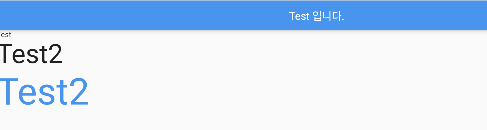

### Text 위젯
> Text 위젯의 사용법 정리

[전체소스](../../lib/basic/TextTest.dart)


- 화면에 문자열을 출력하는 기본적인 위젯
- VSCode에서 ctrl 키를 누른 상태로 마우스 캐럿을 Text()에 가져가면 도움말 표시
- 
- 입력 파라메터로 style에 TextStyle()을 넘겨주며 텍스트를 꾸민다.
    
-   ```dart
        // Text 예제
        Text("Test"),
        Text("Test2", style: TextStyle(fontSize: 50)),
        Text("Test2", style: TextStyle(fontSize: 70,color: Colors.blue)),
    
    ```
 